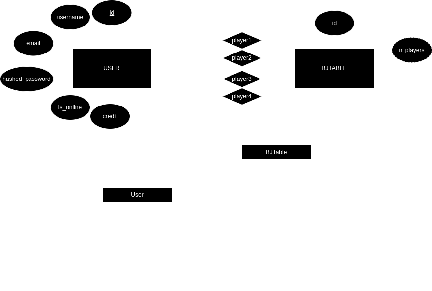

# back-end

Usaremos Python 3.10.x

## Lanzar

```bash
uvicorn deck_king.main:app --reload
```

o

```bash
python -m uvicorn deck_king.main:app --reload
```

## Instalar dependencias

Aconsejable usar un entorno virtual.

```bash
pip install --upgrade pip
pip install -r requirements.txt
```

## Instalar PostgreSQL (Ubuntu) (soy noob) (opcional)

Instalar PostgreSQL:

```bash
sudo apt install postgresql postgresql-contrib
```

Iniciar servicio de PostgreSQL:

```bash
sudo systemctl start postgresql.service
```

Crear base de datos:

```bash
sudo -u postgres psql postgres
postgres=# CREATE DATABASE DECKKINGDB;
```

Para cambiar la password de postgres:

```bash
sudo -u postgres psql postgres
postgres=# \password postgres
```

## API

## REST API

Also at localhost:8000/docs

### Users

#### POST /users/register

Registers user

##### Request body

```json
{
    "username": "username",
    "email": "email",
    "password": "password"
}
```

##### Response

```json
{
    "access_token": "access_token",
    "token_type": "token_type"
}
````

#### POST /users/token

Our 'login' endpoint.

##### Request body

```json
{
    "username": "username",
    "password": "password"
}
```

##### Respose

```json
{
    "access_token": "access_token",
    "token_type": "token_type"
}
````

### Blackjack

TODO

## Websockets schema

### Blackjack

Server will always return a JSON messages with the following structure:

```json
{
    "state": "game_state",
    "turn": "username",
    "pots": {
        "username": "username"
    },
    "cards": {
      "username": [
        {
          "suit": "suit",
          "value": "value",
          "blackjack_value": 0
        }
      ]
    },
    "dealer_cards": [
      {
        "suit": "suit",
        "value": "value",
        "blackjack_value": 0
      }
    ],
    "player_state": {
      "username": "player_state"
    }
}
```

Where:

+ `game_state` can be:
  + `GameState.BET`: The game is in bet stage.
  + `GameState.PLAYING`: The game is playing.
  + `GameState.DEALER`: Dealer plays and game is finishing.
  + `GameState.END`: The game is in end stage.

+ `player_state` can be:
  + `PlayerState.PLAYING`: The player is playing.
  + `PlayerState.STANDING`: The player played stand.
  + `PlayerState.BLACKJACK`: The player got blackjack.
  + `PlayerState.BUSTED`: The player busted.

Client should send a JSON with the wanted action when it's their turn:

When the game is in `GameState.BET`:

```json
{
    "action": "bet",
    "value": 0
}
```

When the game is in `GameState.PLAYING`:

```json
{
    "action": "hit"
}
```

or

```json
{
    "action": "stand"
}
```

### Chat

Chat is very simple, server will broadcast the incoming messages to all clients. With the following structure:

```json
{
  "time": "unix_timestamp",
  "username": "username",
  "message": "message"
}
```

Client should send a JSON with the message to send:

```json
{
  "message": "message"
}
```

## Database


